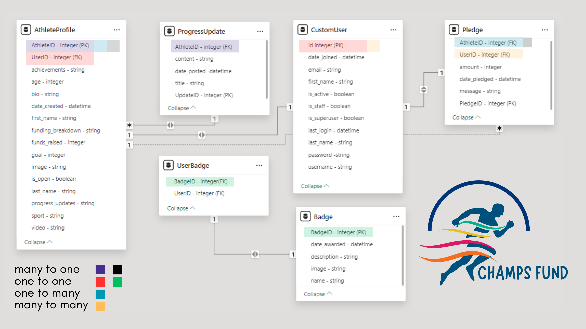
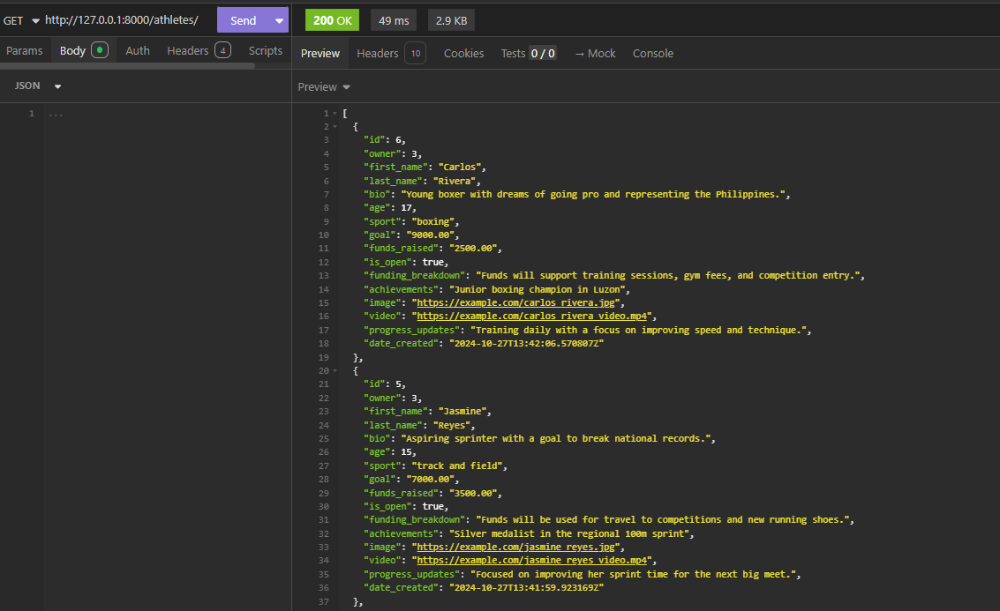
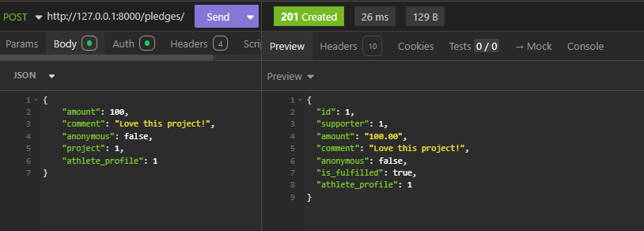
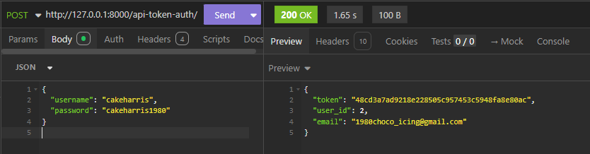
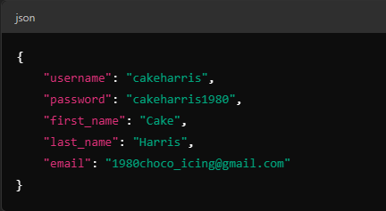
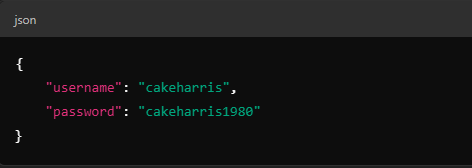
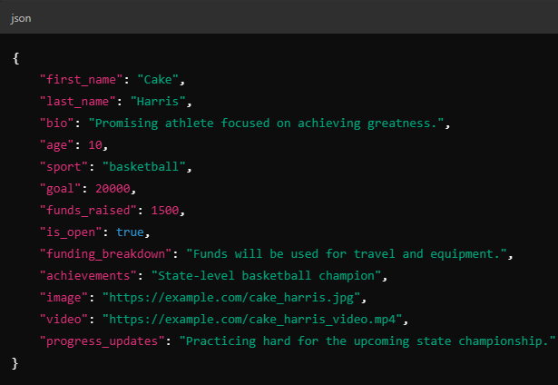

# 🎖️ Champs Fund 🎖️

This project showcases the power of community and the spirit of sportsmanship, leveraging the latest web development technologies with Django REST Framework to create a transparent, user-friendly, and engaging crowdfunding experience.!

### What is Champs Fund? 🏋️
 A crowdfunding platform dedicated to supporting aspiring young athletes in the Philippines who demonstrate exceptional talent but lack the financial means to participate in national competitions. Our platform will bridge the gap between passionate sports enthusiasts and these promising athletes, providing an avenue to directly contribute to their dreams and ambitions. 
 
 Champs Fund platform specifically focuses on supporting aspiring young athletes between the ages of 5-18 years old, helping them to overcome financial barriers and pursue their potential in sports.

🚀 Visit Champs Fund platform and become a part of this journey: https://champsfund-bdc30eae5ee5.herokuapp.com/admin/

### Intended Audience/User Stories
The intended audience for the "Champs Fund" crowdfunding platform includes:

🏃 Sports Enthusiasts: Individuals who are passionate about sports and want to directly support the growth and development of young Filipino athletes. They will use the platform to discover athletes, learn about their backgrounds and achievements, and contribute financially to help them reach their goals.

🕺 Philanthropists: Those who are interested in making a meaningful impact on the lives of underprivileged youth. They will use the website to find athletes whose stories resonate with them and donate towards their training and competition expenses.

🏄‍♀️ Corporations: Businesses looking to support community initiatives, foster positive brand associations, and fulfill their social responsibility goals. They will use the platform to make contributions or sponsor specific athletes or events, gaining visibility and goodwill in the process.

🏄‍♀️ Filipino Diaspora: Filipinos living abroad who wish to contribute to the growth of sports in the Philippines. They can use the platform to support young talents from their home country, helping them pursue their athletic dreams on a national or international stage.}}

### API Spec
| URL                     | HTTP Method | Purpose                                         | Request Body                                                             | Success Response Code | Authentication/Authorization |
| ----------------------- | ----------- | ----------------------------------------------- | ------------------------------------------------------------------------ | --------------------- | ---------------------------- |
| /athletes/              | GET         | Retrieves a list of all athlete profiles.       | None                                                                     | 200                   | None                         |
| /athletes/              | POST        | Creates a new athlete profile.                  | `{ "first_name": "string", "last_name": "string", "age": integer, ... }` | 201                   | Authentication required      |
| /athletes/{id}/         | GET         | Retrieves a specific athlete profile by its ID. | None                                                                     | 200                   | None                         |
| /athletes/{id}/         | PUT         | Updates a specific athlete profile by its ID.   | `{ "first_name": "string", "last_name": "string", "age": integer, ... }` | 200                   | Authentication required      |
| /athletes/{id}/         | DELETE      | Deletes a specific athlete profile by its ID.   | None                                                                     | 204                   | Authentication required      |
| /pledges/               | GET         | Retrieves a list of all pledges.                | None                                                                     | 200                   | None                         |
| /pledges/               | POST        | Creates a new pledge.                           | `{ "amount": integer, "message": "string", "athlete_id": integer, ... }` | 201                   | Authentication required      |
| /pledges/{id}/          | GET         | Retrieves a specific pledge by its ID.          | None                                                                     | 200                   | None                         |
| /pledges/{id}/          | PUT         | Updates a specific pledge by its ID.            | `{ "amount": integer, "message": "string", ... }`                        | 200                   | Authentication required      |
| /pledges/{id}/          | DELETE      | Deletes a specific pledge by its ID.            | None                                                                     | 204                   | Authentication required      |
| /progress-updates/      | GET         | Retrieves a list of all progress updates.       | None                                                                     | 200                   | None                         |
| /progress-updates/      | POST        | Creates a new progress update.                  | `{ "title": "string", "content": "string", "athlete_id": integer, ... }` | 201                   | Authentication required      |
| /progress-updates/{id}/ | GET         | Retrieves a specific progress update by its ID. | None                                                                     | 200                   | None                         |
| /progress-updates/{id}/ | PUT         | Updates a specific progress update by its ID.   | `{ "title": "string", "content": "string", ... }`                        | 200                   | Authentication required      |
| /progress-updates/{id}/ | DELETE      | Deletes a specific progress update by its ID.   | None                                                                     | 204                   | Authentication required      |
| /badges/                | GET         | Retrieves a list of all badges.                 | None                                                                     | 200                   | None                         |
| /badges/                | POST        | Creates a new badge.                            | `{ "name": "string", "description": "string", ... }`                     | 201                   | Authentication required      |

### DB Schema

The diagram shows the relationship between CustomUser, Athlete, Pledge, ProgressUpdate, and Badge. Each Athlete is linked to a specific CustomUser through a foreign key, while multiple Pledges can be associated with a single Athlete or User.

The database schema for Champs Fund represents the data structure used to manage athletes, pledges, users, progress updates, and badges. It defines how data is stored, related, and retrieved within the platform, enabling efficient tracking of user contributions and athlete progress.”

### Insomnia

### GET Athletes

The GET request to the /athletes/ endpoint retrieves a list of athletes from the API. In the response, each athlete is represented by an object containing detailed information such as their id, owner (user ID), first_name, last_name, bio, age, sport, funding details like goal and funds_raised, achievements, images, videos, and progress updates. 

### POST Pledges

The POST request to the /pledges/ endpoint is used to create a new donation for an athlete’s project. The request body includes fields such as the amount (e.g., 100), a comment from the supporter, the anonymous status (whether the supporter wants to remain anonymous), the project ID, and the athlete_profile ID associated with the donation.

### POST Auth

The POST request to the /api-token-auth/ endpoint is used to authenticate a user and obtain an access token. The request body includes the username (cakeharris) and password (cakeharris1988). Upon successful authentication, the server responds with a 200 OK status, indicating that the provided credentials are valid.

### New User and New Project

Step 1: Register a New User
Endpoint: POST /users/

- Open Insomnia and select the POST method.
- Enter the URL: http://127.0.0.1:8000/users/ (adjust if your base URL is different).
- Switch to the Body tab and choose JSON.
- Copy the JSON body provided above into the Body field.
- Click Send to create the new user.
- Response: If successful, you should receive a 201 Created status with details about the new user.

Step 2: Obtain a Token for the New User
Endpoint: POST /api-token-auth/

- Open a new request in Insomnia and set it to POST.
- Enter the URL: http://127.0.0.1:8000/api-token-auth/.
- Switch to the Body tab and select JSON.
- Copy the JSON body above into the Body field.
- Click Send.
- Response: You will receive a 200 OK status with a response containing the token, user_id, and email.
- Copy the token from the response for use in subsequent authenticated requests.

Step 3: Create a New Project (Athlete Profile)
Endpoint: POST /athletes/

Authorization: Token YOUR_ACCESS_TOKEN (replace YOUR_ACCESS_TOKEN with the token obtained in Step 2).

- Open another new request in Insomnia and set it to POST.
- Enter the URL: http://127.0.0.1:8000/athletes/.
- Switch to the Headers tab and add:
- Key: Authorization
- Value: Token YOUR_ACCESS_TOKEN (replace YOUR_ACCESS_TOKEN with the token you copied earlier).
- Switch to the Body tab and select JSON.
- Copy the JSON body above into the Body field.
- Click Send to create the new athlete profile.
- Response: If successful, you should receive a 201 Created status with the details of the newly created athlete profile.

# Thank you for exploring Champs Fund! 🎖️ Let’s bring the dreams of young athletes closer to reality, one pledge at a time.